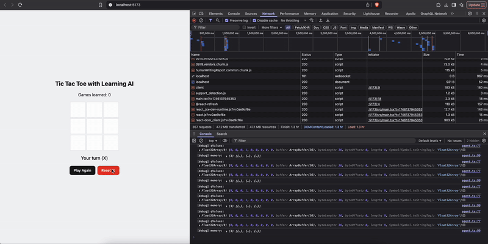
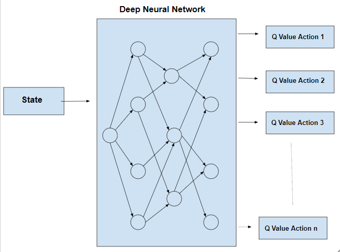

# Tic-Tac-Toe Deep Q-Learning (TensorFlow.js)


This project is a simple experiment with Deep Q-Learning applied to Tic-Tac-Toe, built using React and TensorFlow.js. The goal is to demonstrate how a neural network can learn to play Tic-Tac-Toe through self-play and feedback, using a minimal Q-learning setup.



Live demo at: https://kennaruk.github.io/mlp-tensorflowjs-tictactoe/

## Features

- **Deep Q-Learning**: The AI uses a neural network to estimate Q-values for each possible move.
- **Simplicity**: All Q-learning attributes except the learning rate (`alpha`) have been removed for clarity and simplicity.
- **Persistent Learning**: The AI's model and game count are saved in your browser's local storage, so it keeps learning across sessions.
- **Interactive UI**: Play against the AI and watch it improve over time.

## How It Works

- The AI (O) learns by playing against you (X).
- After each game, the AI updates its neural network based on the outcome (win, lose, tie).
- Only the learning rate (`alpha`) is used; other Q-learning parameters (like gamma, epsilon) are omitted for simplicity.

## Getting Started

### Prerequisites

- [Node.js](https://nodejs.org/) (v16+ recommended)
- [pnpm](https://pnpm.io/) (install with `npm install -g pnpm`)

### Installation & Running

```bash
pnpm install
pnpm start
```

Then open [http://localhost:5173](http://localhost:5173) (or the port shown in your terminal) in your browser.

## Project Structure

- `src/ai/agent.ts`: The Deep Q-Learning agent logic (TensorFlow.js).
- `src/App.tsx`: The main React app and game logic.

## Notes

- To reset the AI's learning, use the "Reset AI" button in the UI.
- This is a minimal, educational implementation and not optimized for performance or advanced strategies.

## License

MIT
